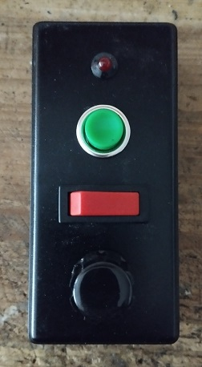
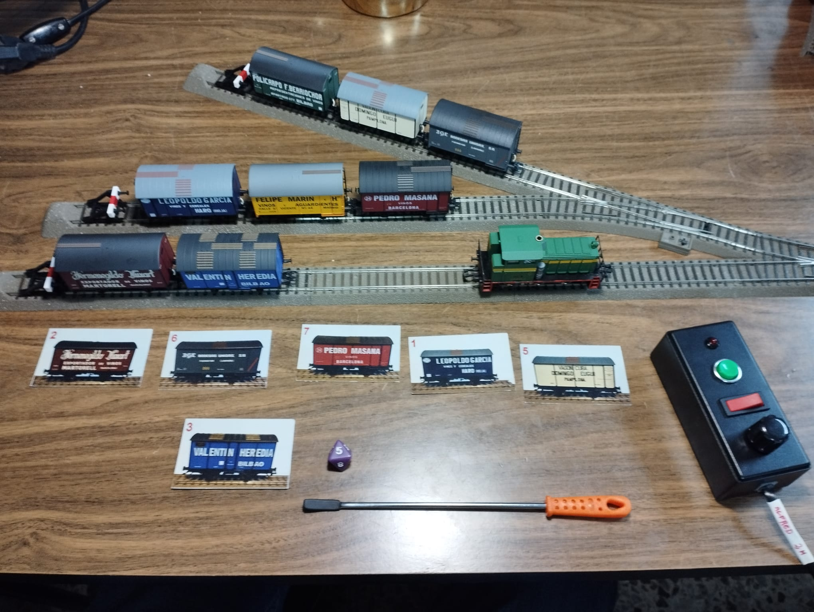

## ArduXED

ArduXED (**Ardu**ino **X**pressnet **E**infacher **D**rehregler) was born from the idea of having an additional throttle for controlling locomotives with minimal functionality similar to FREMO's FRED throttle for Loconet, but for the Xpressnet bus. 

It's ideal for leaving for our guests or young enthusiasts so they can control a single train on our model. The throttle only has a potentiometer for controlling the locomotive's speed, a switch for selecting the direction of travel, and a button to activate a function. 

Only requires adding an Arduino, a diode, and a MAX485 as an interface to the Xpressnet bus.

# Drive

To begin controlling our locomotive, select the direction of travel with the switch and set the potentiometer to zero for at least one second. You can now control the speed. 

You must also set the potentiometer to zero. If you change direction while the locomotive is running using the switch, it will stop immediately. 

Pressing the button will activate and deactivate the assigned function (from F0 to F4).

# Selecting locomotives

Set the direction of travel switch to forward and hold the button while connecting to the  Xpressnet bus until the LED remains lit steadily. 

On another throttle connected to the Xpressnet bus, select the locomotive to be assigned and turn on the F0 function (light). At this point, the ArduXED LED will turn off, indicating that the locomotive has been assigned. 

Set the potentiometer to zero and you will be able to control the speed of the new locomotive. 

If you want to assign another function (F1 to F4) instead of F0 to the ArduXED button, activate it on the other throttle before activating the F0 function.

# Change Xpressnet address

Each Xpressnet device requires a unique bus address between 1 and 31 that is not used by any other device. To assign a new Xpressnet address to the ArduXED, move the direction switch to reverse and set the potentiometer to zero.

Hold the button while connecting to the Xpressnet bus until the LED remains lit and briefly turns off.

The potentiometer's travel is now divided into 32 zones. Move the potentiometer to the zone that corresponds to the address you want to assign, or leave it at zero to assign the default address indicated in the sketch (DEFAULT_XNET_ADR).

Move the direction switch forward to assign it. The LED will now turn off, indicating that the new Xpressnet address programming is complete.

---

Paco Cañada

https://usuaris.tinet.cat/fmco/

https://fmcopaco.github.io/

